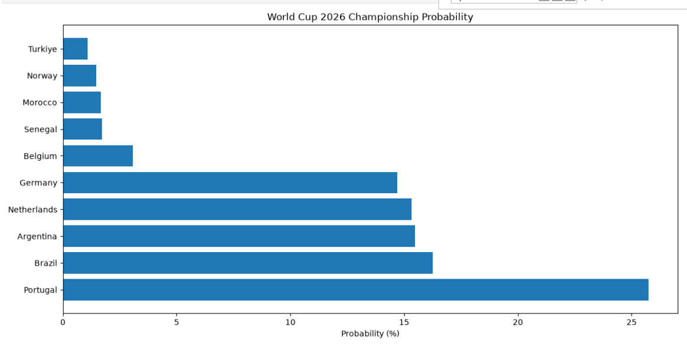
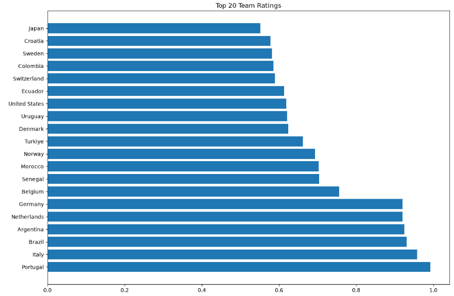

# FIFA World Cup 2026 Prediction

Predicting the FIFA World Cup 2026 champion using:

- FIFA Rankings
- Transfermarkt Market Values
- Monte Carlo Simulation
- Probabilistic Match Modeling

## Project Overview

This project estimates each national team's probability of winning the FIFA World Cup 2026.

The model combines:

- FIFA ranking strength
- Squad market value
- Logistic win probability model
- Group stage simulation
- Knockout stage simulation
- 10,000 Monte Carlo tournament runs

## ScreenShots

## Dataset

Source:
Transfermarkt Player Scores Dataset

## Results

Top championship contenders:

| Team | Probability |
|------|-------------|
| Portugal | XX% |
| Brazil | XX% |
| Argentina | XX% |

## Technologies

- Python
- Pandas
- NumPy
- Scikit-Learn
- Matplotlib
- Jupyter Notebook

## Future Improvements

- Elo Ratings
- xG Model
- Streamlit Dashboard
- Real Qualification Data