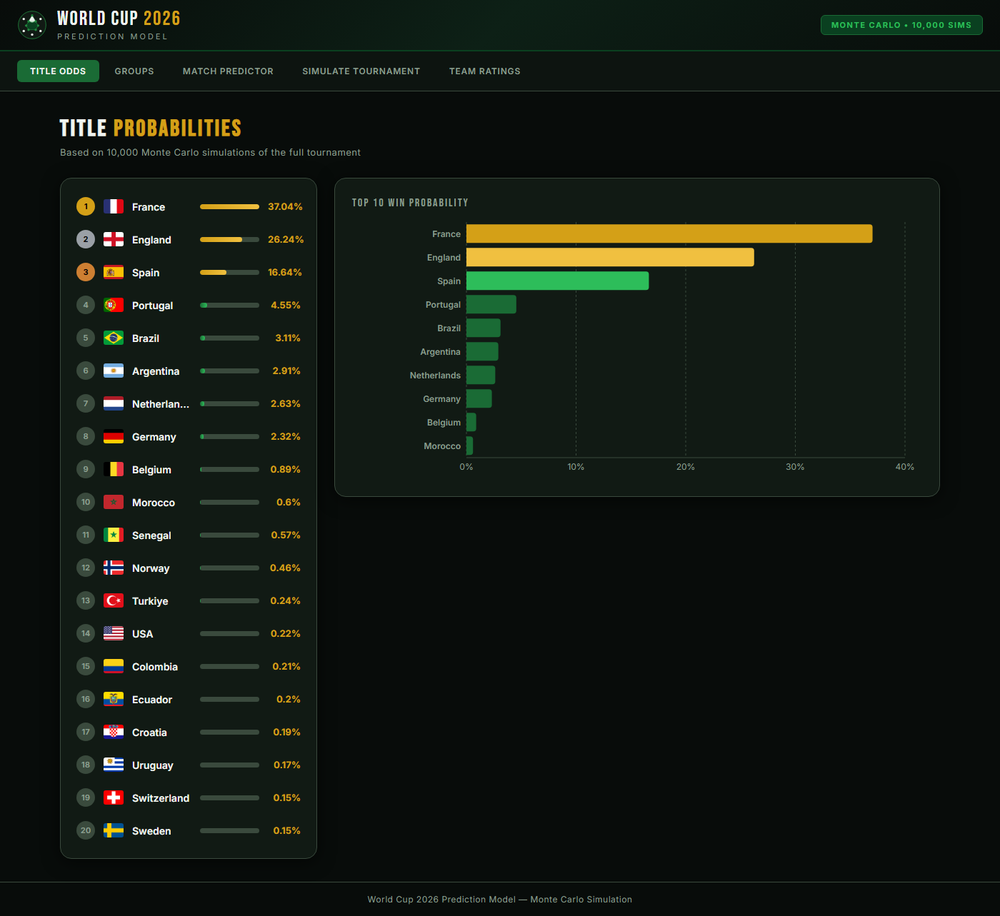
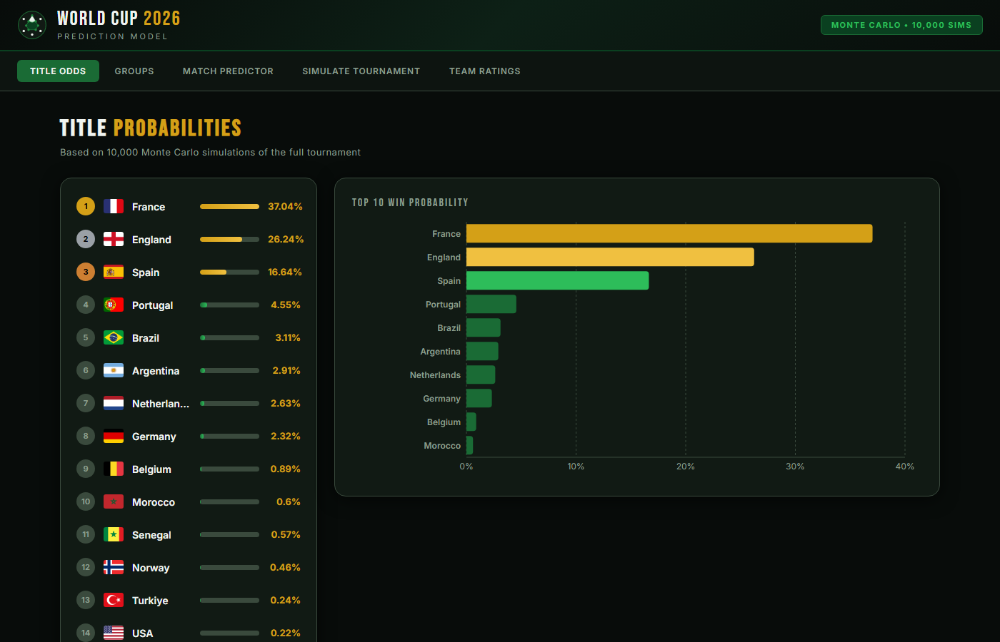
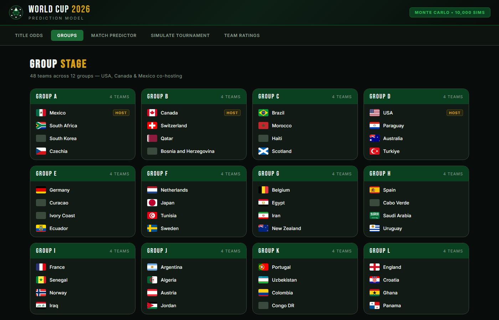
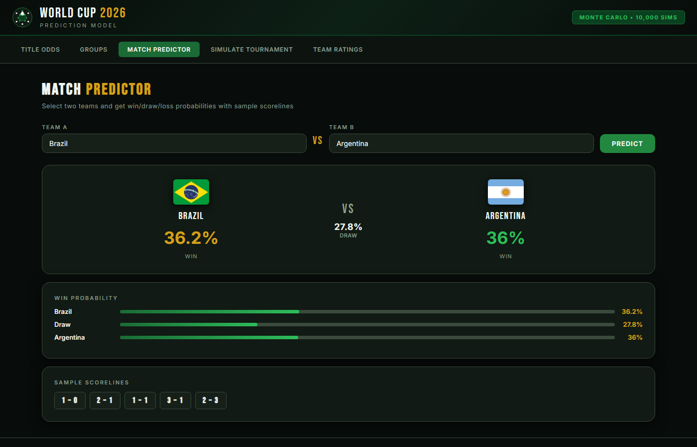
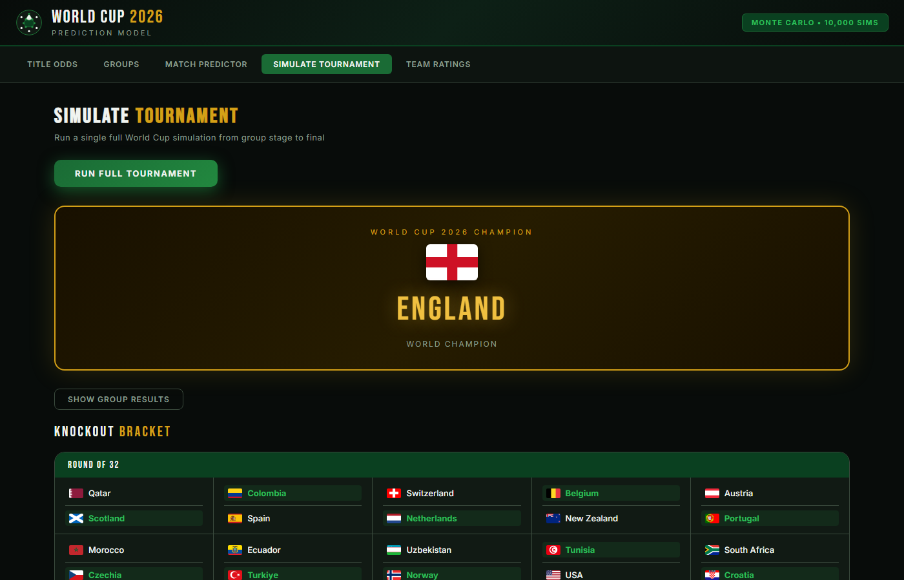
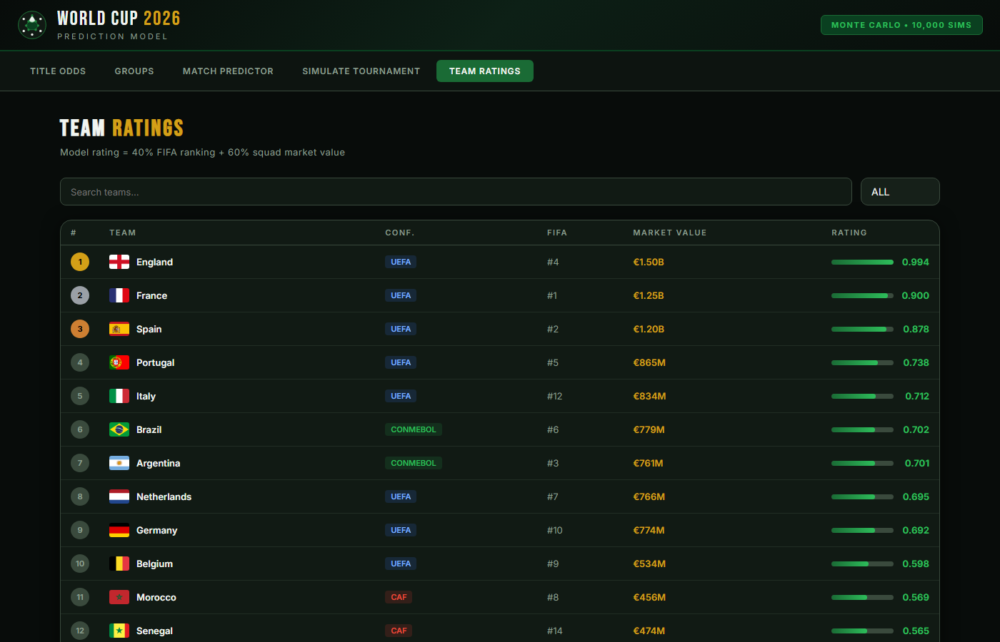

# World Cup 2026 Prediction Model

A Monte Carlo simulation engine and interactive React dashboard for predicting the FIFA World Cup 2026.



---

## Overview

The model runs 10,000 full tournament simulations — group stage through the final — using each team's FIFA ranking and squad market value to generate probabilistic match outcomes. Results are served through a Flask REST API and visualised in a dark, football-themed React dashboard.

---

## Screenshots

| Title Odds | Groups |
|---|---|
|  |  |

| Match Predictor | Simulate Tournament |
|---|---|
|  |  |



---

## How It Works

### Team Rating

Each team receives a composite rating built from two normalised signals:

```
team_rating = 0.4 × (normalised FIFA ranking) + 0.6 × (normalised squad market value)
```

Manual market value corrections are applied for France (€1.25B), England (€1.5B), and Spain (€1.2B) to reflect their true squad depth.

### Match Probabilities

Win/draw/loss probabilities are derived from a logistic function over the rating difference:

```
P(A wins) = sigmoid(γ × Δrating) × (1 − P(draw))
P(draw)   = 0.28 × exp(−|γ × Δrating|)      where γ = 5
P(B wins) = 1 − P(A wins) − P(draw)
```

USA, Canada, and Mexico receive a 5% rating boost as co-hosts.

### Tournament Structure

- **Group stage**: 48 teams across 12 groups (A–L). Each team plays 3 matches. Top 2 from each group + 8 best third-placed teams advance (32 teams total).
- **Knockout stage**: Round of 32 → Round of 16 → Quarterfinals → Semifinals → Final. No draws — winner is drawn from win probabilities directly.

### Monte Carlo

The full tournament is simulated 10,000 times. Each team's title probability is `wins / 10,000 × 100`.

---

## Dashboard Features

| Tab | What it shows |
|---|---|
| **Title Odds** | Ranked list + horizontal bar chart of championship probabilities from the 10,000-sim run |
| **Groups** | All 12 groups with national flags and host-nation badges |
| **Match Predictor** | Pick any two teams — get live win/draw/loss % and 5 sample scorelines |
| **Simulate Tournament** | Run a single full tournament live; see group tables and the full knockout bracket |
| **Team Ratings** | Searchable, filterable table with FIFA rank, market value, confederation, and model rating |

---

## Tech Stack

| Layer | Technology |
|---|---|
| Model | Python, NumPy, pandas, scikit-learn |
| Backend API | Flask, flask-cors |
| Frontend | React 18, Vite |
| Charts | Recharts |
| Fonts | Bebas Neue, Inter |
| Data source | Transfermarkt via Kaggle |

---

## Project Structure

```
world_cup_2026_prediction/
├── data/
│   ├── national_teams.csv       # team metadata, FIFA ranking, market value, flag URLs
│   ├── players.csv
│   ├── games.csv
│   └── competitions.csv
├── outputs/
│   ├── national_teams_with_ratings.csv
│   ├── world_cup_2026_probabilities.csv
│   └── final_world_cup_2026_predictions.csv   # pre-computed 10,000-sim results
├── notebooks/
│   └── world_cup_2026_prediction.ipynb        # model development notebook
├── api/
│   ├── model.py                 # all simulation logic
│   └── app.py                   # Flask REST API (port 5000)
├── dashboard/
│   ├── src/
│   │   ├── components/
│   │   │   ├── Header.jsx
│   │   │   ├── Predictions.jsx
│   │   │   ├── GroupStage.jsx
│   │   │   ├── MatchPredictor.jsx
│   │   │   ├── TournamentSim.jsx
│   │   │   └── TeamRatings.jsx
│   │   ├── assets/              # screenshots
│   │   ├── App.jsx
│   │   └── App.css
│   └── package.json
└── start.ps1                    # one-command launcher
```

---

## Running Locally

### Requirements

- Python 3.9+
- Node.js 18+

### Setup

```bash
# 1. Install Python dependencies
cd world_cup_2026_prediction
python -m venv venv
venv\Scripts\activate        # Windows
pip install flask flask-cors pandas numpy scikit-learn

# 2. Install frontend dependencies
cd dashboard
npm install
```

### Start

**Option A — single script (PowerShell):**

```powershell
.\start.ps1
```

**Option B — two terminals:**

```bash
# Terminal 1: Flask backend
cd api
..\venv\Scripts\python.exe app.py
# Listening on http://localhost:5000

# Terminal 2: React frontend
cd dashboard
npm run dev
# Listening on http://localhost:5173
```

Open **http://localhost:5173** in your browser.

---

## API Reference

| Method | Endpoint | Description |
|---|---|---|
| `GET` | `/api/predictions` | Champion probabilities from the pre-computed 10,000-sim CSV |
| `GET` | `/api/teams` | Top 48 teams with ratings, FIFA rank, market value, flag URL |
| `GET` | `/api/groups` | All 12 groups with team names and flag URLs |
| `POST` | `/api/match/predict` | `{ team_a, team_b }` → win/draw/loss % + 5 sample scores |
| `POST` | `/api/simulate/tournament` | Full tournament simulation — groups + knockout bracket |
| `POST` | `/api/simulate/monte-carlo` | `{ n }` → run N live simulations (max 5,000) |

---

## Model Limitations

- Ratings are computed purely from FIFA ranking and squad market value — recent form, injuries, and tournament draw luck are not modelled.
- The 10,000-sim results are pre-computed from a fixed dataset; re-running the Monte Carlo live will produce different probabilities each time due to randomness.
- Third-placed qualification uses a simplified points + rating tiebreaker rather than the official UEFA/FIFA head-to-head rules.
